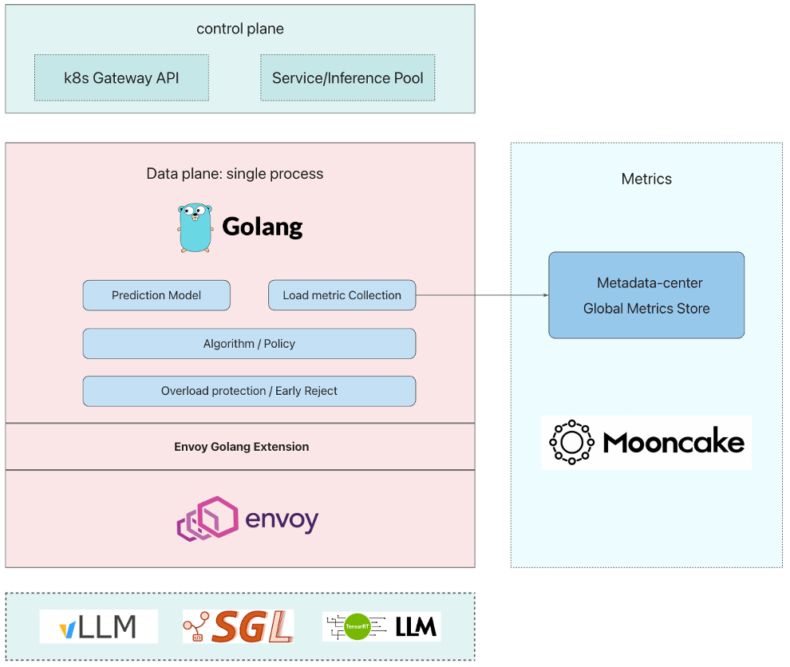

## AIGW

大模型推理服务的智能枢纽（推理网关）

[English](README.md) | 中文

## 关于

AIGW 是大模型推理服务的 智能枢纽（推理网关），通过负载感知、KVCache 感知、Lora 感知 的全局路由方案，提供智能路由，过载保护，多租 QoS 等能力，降低时延，提升集群服务能力。

## 架构

### 亮点

1. 灵活强大、易维护的 Envoy Golang 扩展
2. 准实时的指标采集
3. 均衡的多因子综合决策算法
4. 支持水平扩展的高可用架构

## 开发者指南

[Developer Guide](docs/zh/developer_guide.md)

## 社区

AIGW 是基于 Envoy 和 Istio 构建的，向他们致以诚挚的感谢。

## 规划

1. 精确 cache-aware
2. 基于时延预测的多租 SLO 感知算法
3. PD 分离调度
4. DP 粒度调度

## 许可证

本项目基于 [Apache 2.0](LICENSE) 许可证发布。
